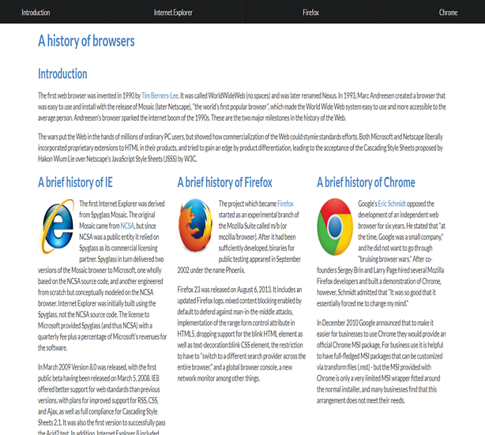

## Introduction

Prior to my Software Engineering 1 class, I had no idea what front-end frameworks were. Initially, I thought that every single front-end developer has all the time and expertise
to code everything in raw HTML and CSS every time they worked on a project. Although that is very impressive (at least to a novice person like myself), I now understand why
frameworks have caught the attention of most.

## My Experience

I was introduced to Semantic UI, a framework, just last week. I had to go through an extensive five hours of an introductory course by Nate Taylor on Pluralsight. I was eager to
learn at the beginning, but to be honest, after watching the first 30 minutes, the videos became background noise while I was working on something else. I was able to grasp some
key concepts such as containers, images, menus, and that’s about it. This was because I was on a time constraint and wanted to finish as soon as possible. I made sense of the
fact that my passive learning would have a negative impact on my next few assignments, but to my surprise, the penalty was not as much as I expected.

*“Semantic empowers designers and developers by creating a shared vocabulary for UI.”*

This is because Semantic UI emphasizes their most well-known feature: using natural English language. This means that it uses common syntax and simple phrases to simply create
what you want. For example, if I wanted to create a four item menu bar, I could simply type: <code class="language-plaintext highlighter-rouge">ui four item menu</code>. And from
there I can further manipulate the menu bar's color, size, or add dropdowns with Semantic UI. The results give you a clean polished look without starting from scratch.

  

    

    Raw HTML and CSS

  

  

    

    With Semantic UI

  

## Takeaways

Like everything else in life, learning to master a skill takes time and effort, no matter how simple it may seem. I don’t want to encourage someone to use Semantic UI because it
is easy and fast to learn because that’s simply not the truth. It takes practice and experience to comprehend the capabilities of this framework along with trial and error of
what you can and cannot do. Rather I would encourage someone to use a framework like Semantic UI because the trade-offs of investing time and going through the frustration of
learning it is quite rewarding.

One of the benefits is that it greatly reduces the length of code. There is no need to start from complete scratch and create everything step by step because Semantic UI solves
that problem. Shorter code means less bugs and/or easier time debugging. The use of natural English wordings also assists in the process of debugging because it is clear to
read. Ultimately, using Semantic UI saves a lot of time and is more work-efficient, while giving your web page a professional and attractive appearance.

## Final Thoughts

While Semantic UI is an appealing and compelling implementation to web design, it raises the questions of, “Do I truly know how to use HTML and CSS? Do I have the
capabilities of producing a well thought out website without a framework?” Formulating a full and immediate response is not much of a concern right now because I'm still a fair
beginner. Although, I do believe that as long as I know the necessary basic knowledge of HTML and CSS, I should be allowed to take advantage of Semantic UI and other alike tools
for the sake of time and efficiency. It is also a bonus to have a shortcut of creating a cinematic feel to a web page.

