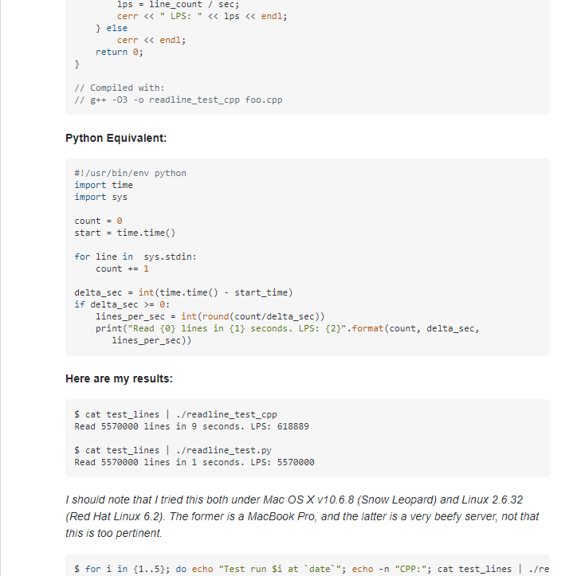

## "How Do You Ask a Smart Question?" is a Smart Question

After reading Eric Steven Raymond’s essay on <a href="http://www.catb.org/~esr/faqs/smart-questions.html">"How To Ask Questions The Smart Way"</a>, it taught me that asking questions plays a big role when it comes to effectively communicating 
with people. Smart questions are important for smart software engineers because it guides them forward into what they want to accomplish. If you want a good answer, then you must
formulate a good question. But what constitutes a good question? First, it is essential for us to examine and identify the components of what makes a bad question unappealing.

## Don't Do This

A bad question will usually demonstrate little to no eagerness on why and how to solve a problem. Instead, the questioner will only be interested in what the answer is, just for 
the satisfaction to get something to work. The problem with this is that it defeats the purpose of asking a question to learn and strengthen any weak spots in a particular skill. 
Bad questions will also be accompanied by zero attempts on finding an answer before asking their own question. In Raymond’s essay, he suggests finding an answer by searching the 
web, reading the FAQ or manual, asking a skilled friend, etc. 

<a href="https://stackoverflow.com/questions/20574925/c-file-homework">This</a> question from StackOverFlow is a prime example of what not to do when asking a question. The title of the post, “C File Homework” is meaningless and does not tell the audience
much about what the problem is. The post is then continued with the user’s homework assignment and their attempt of code at it. The only question asked was “Can you please help 
me?”

The questioner did not specifically describe what their problem was. They failed to put any thought into forming a question that will help them further their understanding of the
problem. It also lacked the details of pinpointing their ideas of what a potential error could be and what they already have tried. The post received several down votes, a 
violation of StackOverFlow's guidelines, and most importantly bad answers. The responses varied from followup questions, guesses on how to correct the given code, and unspecific 
answers. These three things are probably what the questioner did not want. Consequently, they did not get much from their bad question.

## Do This Instead
In contrast to the bad question we just reviewed, good questions will usually line up with Raymond’s guide on asking smart questions.  These types of questions will display 
genuine curiosity from the user. This is evident showing that they have specifically recognized what the problem was other than the fact that their code “doesn’t work.” They 
also have provided meaningful details of their trials and errors. These components are some of the building blocks of asking a smart question. 

<a href="https://stackoverflow.com/questions/9371238/why-is-reading-lines-from-stdin-much-slower-in-c-than-python?rq=1">This</a> post from StackOverFlow utilizes the effective way of asking a question. The questioner illustrated an absolute interest in their topic of question of “Why is reading 
lines from stdin much slower in C++ than Python? This was done by supporting the question with tests of their C++ and Python code and comparing the time of each one. They also
provided details on what operating systems and machines they were performing the tests on. Another element of their question is the approaches the questioner took by 
implementing different ways to run their tests.

It seemed like the responders were exhibiting legimitent concern for the questioner’s curiosity. As a result, their detailed, straightforward question received insightful answers. This is a good experience on all sides: the questioner learned something and others elicited new ideas and viewpoints. The post even included a brief answer to their question after it was resolved, which is a nice followup according to Raymond’s guide. 

## Conclusion

We are very fortunate to have the internet and all these forums to communicate our desire to find an answer in just a few minutes. We should be even more fortunate that there
are generous people out there who are willing to respond to our curious minds. Taking advantage of that would be by demanding an answer while learning nothing throughout the
process. So make sure to ask a question the smart way! It will be beneficial for everyone. 

