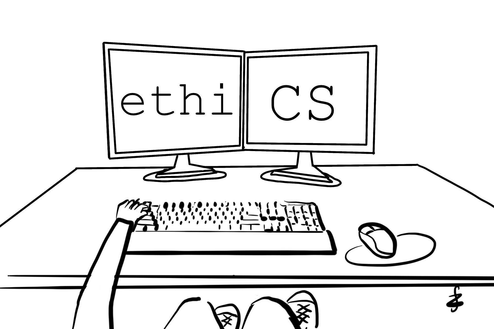
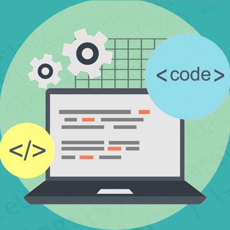
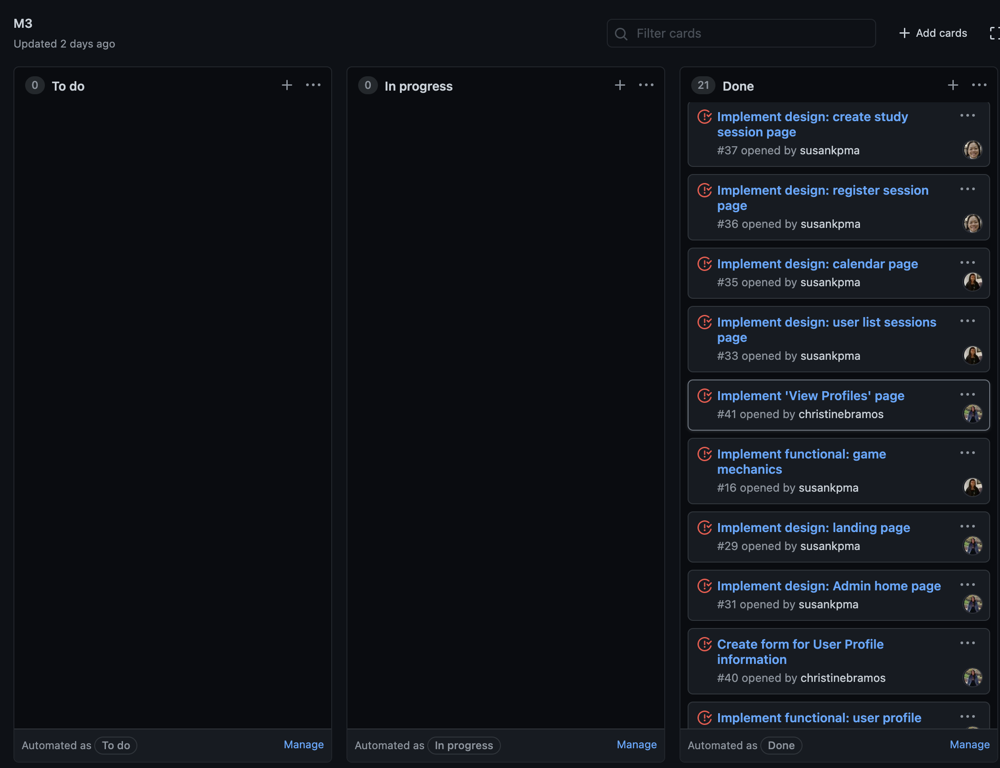

## beginig

In the span of these past five months, I felt like there were many foreign software engineering concepts and techniques that were thrown at me all at once. But somehow, with the guidance of the two ICS 314 professors and the teaching assistant, I was able to get through it. I feared that my laziness and habit of procrastination would get in the way of being successful in the class, but I was able to overcome it. I think the main thing that made this course an excellent experience, was my eagerness to learn more due to the hands-on assignments. Although the skills I acquired in this course were mostly applied to web applications, I believe that I will also use these skills beyond that and utilize them in whatever I do in life.

## Ethics in Software Engineering

During my time in this course, I learned to understand the (surface-level) significance of ethics held in the world of computer programming. I must admit that ethics was one of the last things that came to mind when I think about software engineering. After all software engineers design and develop software products intended for the public so it makes sense for ethics to have an important role. The choices a programmer makes can greatly affect others. Perhaps, it can also alter the programmer’s reputation. I do hope to make the best decisions so that I can deliver excellent software products to the public people. 

Beyond web application development and software engineering, to have the ability to recognize what is ethical and what is not, will truly define a person’s morals. But that topic is another whole can of worms.

## Coding Standards

Coding standards is a neat thing for every programmer to keep in mind while coding because it encourages the concept of having clean, readable, and structured code. It also ensures the ease of debugging code, which is a wonderful thing to have. Imagine the horror to read code where programmers had different coding conventions: *disgusting.* Coding standards don’t only apply to web application development. It applies to *every* coding project, especially when it comes to collaborating with other programmers. In this course, I learned to effectively utilize ESLint on IntelliJ, which has greatly improved the appearance and simplicity of my code.

## Agile Project Management

Teamwork is nothing without some sort of agile project management, which is a way of taking large projects and breaking them down into smaller tasks so that they are do-able within a time constraint. In our final project for this course, we used a style of agile project management called Issue Driven Project Management (IDPM). We utilized a kanban board to visually display and organize our work goals. The board is divided up into three columns: To do, In progress, and Done. Each column contains a task, also known as an issue, depending on its status. I personally find this way of managing team work, or even individual projects, to be very efficient and simple. I can see myself using this in future projects.

Although not direct, marching band is an example beyond web application development that uses a version of agile project management. We prepare for a halftime show for every football game. Learning a new show every week was very intimidating to me at first, but I realized how helpful it was to divide up each show into sections and have a goal for each practice. Then at the end of the week, an entertaining performance was ready for the audience.

## end

This athletic software engineering experience was indeed a rigorous one. I had to develop a stable study schedule for this class so that I don’t fall behind, which is also a lesson that can be applied to many other things. This course and teaching style has definitely opened up my eyes to software engineering as a possible career, considering the fact I still have no idea what path I want to take in the world of computer science. Ultimately, I hope to strengthen and enhance my newly obtained knowledge and skills.

