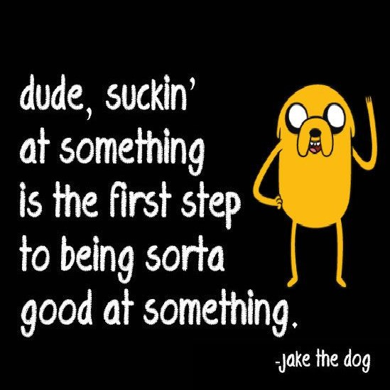

*Sucking at something is the first step to being sorta good at something.* -From the T.V. Show: *Adventure Time*

## The Initial Reason

If someone were to ask college freshman Yhanessa why she chose to be a computer science major, she would be lying if she responded with, “I was fascinated with electronics, technology, and computers ever since I was little.” Although that sentence is true, it’s not the reason why I chose computer science as my major. From middle school to my junior year of high school, I was set on majoring in an engineering discipline. But that all changed when I overheard a dull conversation between two high school seniors in my pre-calculus class.
 
“Hey, what are you majoring in?”

“Computer science.”

“Computer Science.” Those words stood out to me. I didn’t know that was an available major at the time. Then for some reason, my commitment in getting into engineering got thrown out of the window and computer science sweeped in.

And that’s how I very plainly ended up declaring my computer science major at the University of Hawai’i at Manoa.

## Maintaining my new commitment

The first couple of weeks of my Java introductory class, I felt pressured that my peers already knew how to code while I was still trying my hardest to grasp on to the concept of loops. A  sense of discouragement led me to a series of conflicting thoughts about changing majors because it seemed like I was behind and will never catch up to everyone else. The main question of  “Why did you choose computer science?” would flood my mind on my off-days. The answer was still unknown to me at the time. Fast forward, I went through the rest of my ICS classes on autopilot - doing the work just to do it.

## Terminating Negative Mindsets:

I did lots of self reflecting on how cloudy my mind was during the stay at home order at where I live. I remembered the time consuming programming I did, then I realized that there is nothing wrong with telling myself that it’s okay to take my time. I used to drain my thoughts on the notion of comparing my progress to everyone else’s. I learned that dreading onto my negative mindsets was the main reason why I was behind. I also acquired the knowledge that there is no absolutely no rush to decide what path I want to pursue. With all that self-reflection, I am now able to focus on improving myself and my skills. It helped me put on the right track of focusing on exploring things I want to do in the future. 

## The Future

I’m open to software engineering being a possible option for me to go after as I am interested in learning how software development works and possibly creating an application that is useful to everyone.  I’m also interested in user interface and user experience design to help further improve softwares. Web development likes to pop in my thoughts sometimes. Cyber security has also been on my mind for a while now, but to be honest I have my doubts there. I just want to try a lot of new things while in the search for my strong suit.

The kinds of skills I want to develop in the future is improving my coding skills. The only way to do that is by practicing and motivating myself by envisioning the things I hope to create one day.  Along with that, I want to set goals for myself to create projects while adding in a sprinkle of creativity, instead of just programming. Presenting myself as a confident person is also a skill I hope to obtain one day because it will only help me to better my future.

I hope to build up on experience as well as collaborate with others by making friends who have the same interests as me. Landing internships is also an excellent way for me to gain experience. I also hope to face failure and rejection (not all the time) in my journey of gaining experience so that I know how to deal with them and know how to learn from it. This will only help me get stronger in developing my skills. 

With the combination of my creativity of music and poetry, and my appreciation for logic and problem solving, I chose computer science because it opens a door where I can integrate the arts and logic to create new things and make a change. But in order to successfully do that, I will just have to go at my own pace as long as I eventually get there.
