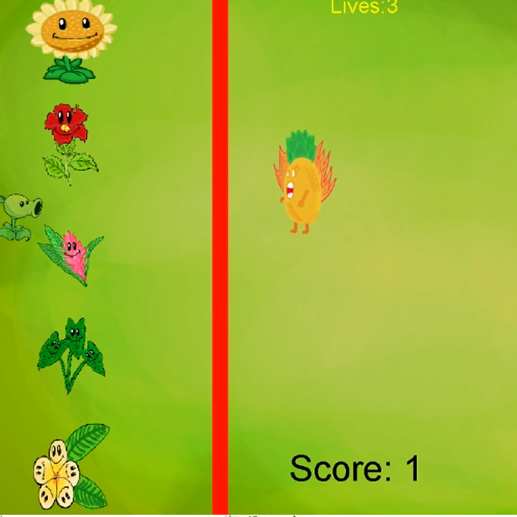
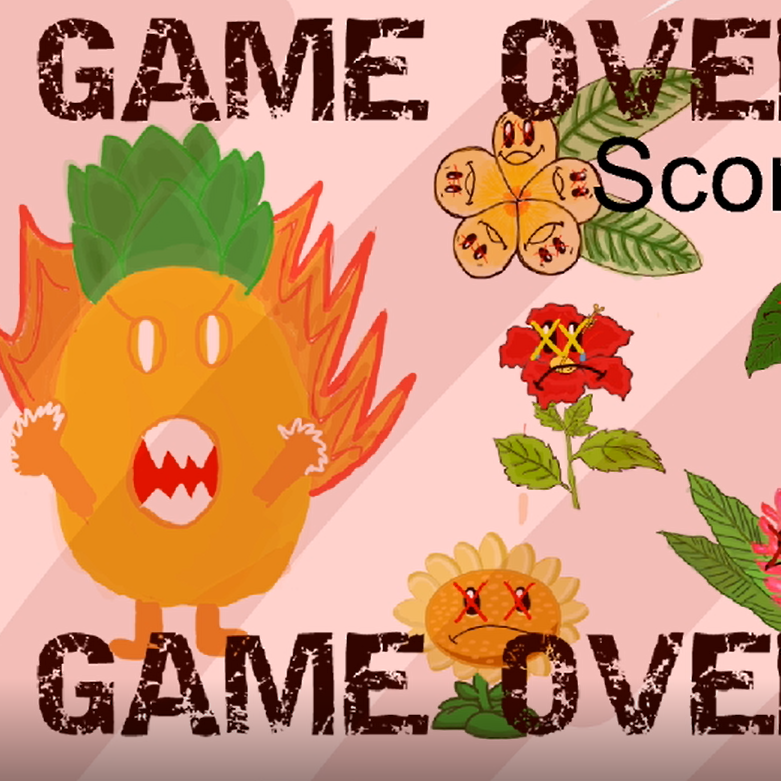
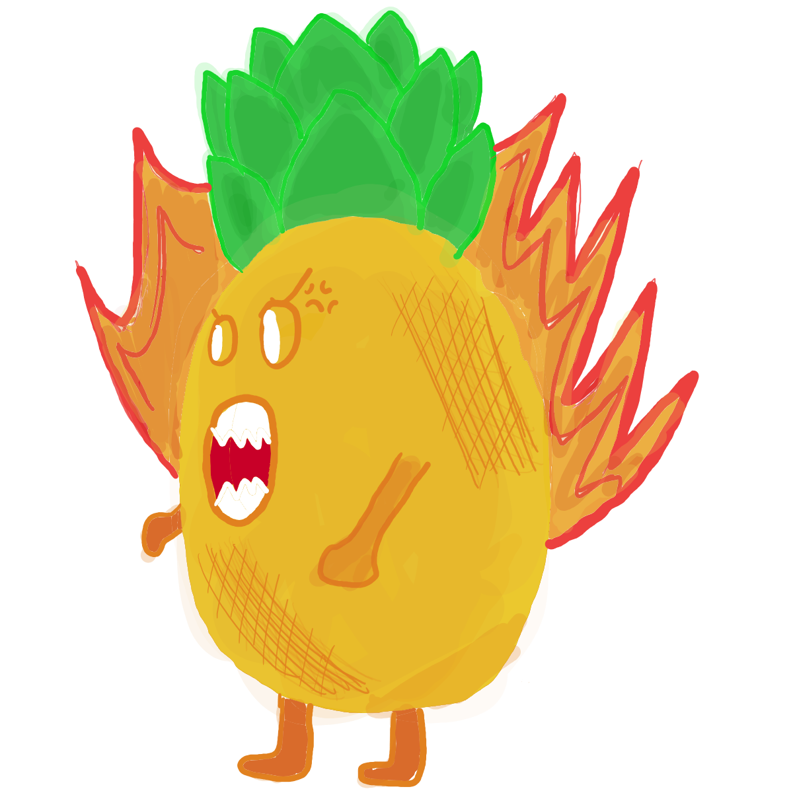
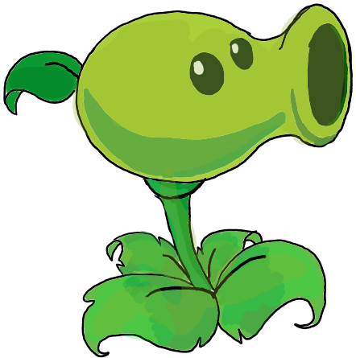

  
  
  
  

Plant vs. Pineapple is a game I worked on with a classmate as a final project for ICS 111. This simple game is inspired by the mobile app "Plants vs. Zombies." One of the difficult parts of this project was coming up of an idea of what our project will revolve around. Thus, we created a very water-ed down version of the famous app. The player plays as a pea plant by using the arrow keys. The objective of the game is to earn as many points by shooting the incoming pineapple with coconuts. The player has 3 lives and will lose a life when you let the pineapple cross the red line. When all 3 lives are gone, the game is over.

This game is coded in Java with the help of <a href="http://www2.hawaii.edu/~dylank/ics111/">EZJava</a>, which is a "multimedia library designed to make it easier for novice programmers to quickly build Java applications that incorporate graphics and sound." During the process, I was able to develop more basic skills with coding in Java and working with object oriented programming. I got more used to working with classes, creating objects, and writing neat code with comments, correct indenations, and variable naming.

I was also in charge of the graphics of the game. For this, I used Medibang as our main tool for digital drawing. I have no art skills whatsoever, therefore most of the artwork was traced. Another takeaway from this project was collaboration. It taught me how to effectively communicate with my partner by planning out the tasks of each person, scheduling times to meet up, and helping each other out.

A demonstration of Plant vs. Pineapple can be found <a href="https://youtu.be/923Q8Hmbrxg">here</a>
