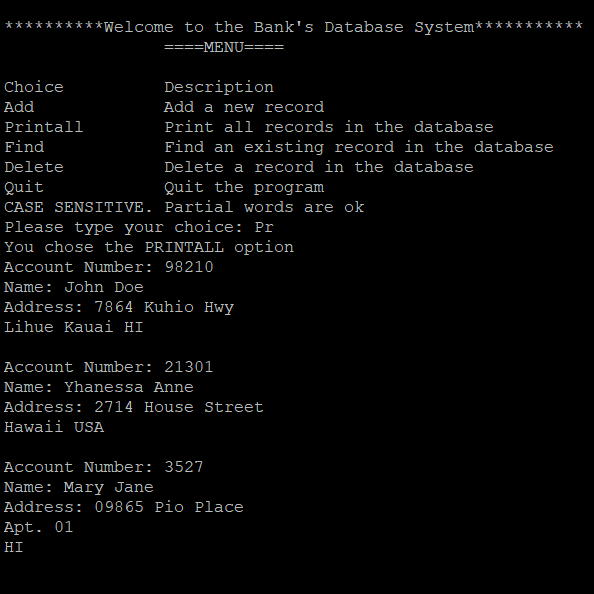

Records database is a project I programmed for ICS 212 on Unix. There are two versions of this project: one in C and the other in C++. The database contains users' infomation such as their name, account numbers, and addresses. The records are stored in a text file in descending order. The user has the option to add, delete, find, and view all records that are in the database. 

Aside from the C and C++ fundamentals, an important skill I learned during the process of this project was tracing. When my code did not compile or produce the desired outcome, I had to force myself to sit down and actually trace my code in order to understand what each and every line did. This technique was effective in a sense that it helped me acknowledge what my mistakes were and learned how to fix them. 

Tracing helped me get rid of the habit of changing random code and praying that it will work.

Source code to be made available soon.
