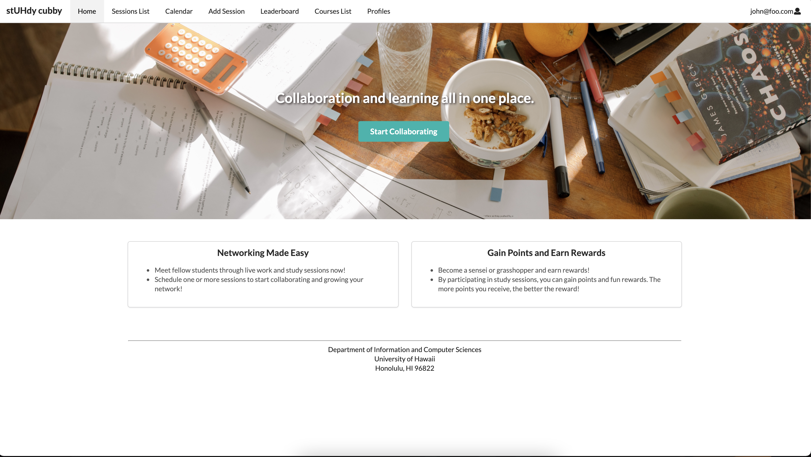

## About stUHdy Cubby
stUHdy Cubby is a web application catered towards UH Manoa students majoring in Information and Computer Science (ICS) students. The purpose of this application is to encourage ICS students to study face-to-face with classmates and peer mentors to effectively study and learn the material. This is because sometimes it is difficult to study on their own due to many distractions and needing external help. stUHdy Cubby enables ICS students to easily register and create study sessions for various types of work such as projects, homework, and studying for exams.

## Features
Features of this application include: register for a session, create a session, a point reward system, and calendar to display events.

## Contribution
My group consisted of myself and two other people. My contribution to this group project was working on the calendar, leaderboard, and list session pages. More specifically I was in charge of creating mockups, getting it to function, and designing those pages. I was very fortunate to have a group partner who was familiar with GitHub so I learned a lot from her, especially when it came to the Issue Driven Project Management (IDPM) concept which was an essential part of the project. My other group partner was also very helpful when it came to me struggling on my tasks of the project and is very knowledgeable. Overall, it was great working with them.

## Takeaways
Creating this web application forced me to remember everything I learned from the beginning of my software engineering class and apply all of that into this one project. One of them was IDPM. It taught me that any large project can be tackled when it is broken down into smaller parts. During this project, it reminded me how much I have forgotten about the usefulness of underscore. Because of this, I had to re-learn underscore and their uses. I also was able to strengthen my familiarity with Semantic UI and Meteor. 

Our <a href="https://github.com/stuhdy-cubby">Organization GitHub Page</a>
